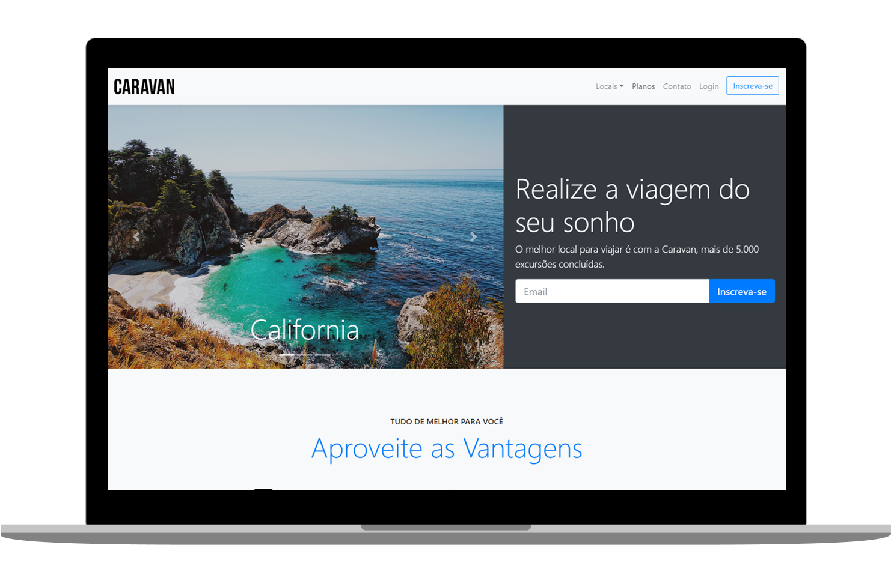

<h1 align="center">
  CARAVAN
</h1>

  
  

  
  
  
  

  

## ◾ Projeto

O Caravan é um projeto totalmente responsivo feito apenas com Bootstrap 4. O principal intuito era treinar e conhecer todos os componentes e ferramentas desta biblioteca.

#### Visitar o site: [Caravan.com Offline](https://google.com)

## ◾ Tecnologias

Esse projeto foi desenvolvido com as seguintes tecnologias:

- [BOOTSTRAP 4](https://getbootstrap.com/)

## ◾ Licença

Esse projeto está sob a licença MIT.

